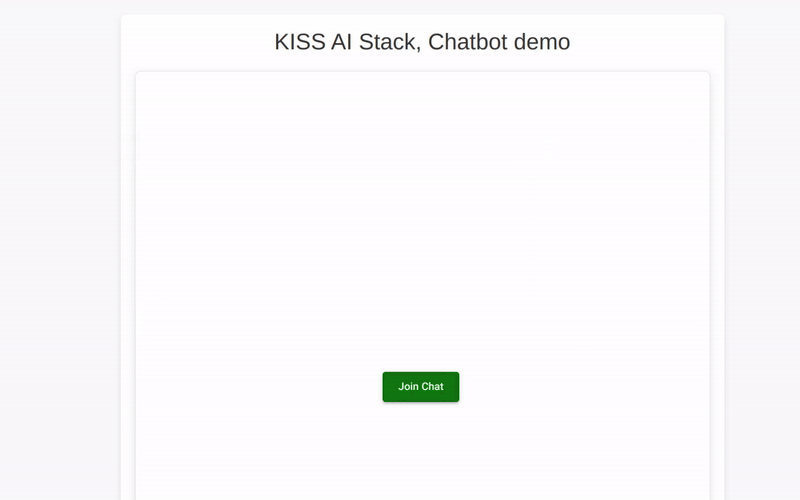

# Chatbot Demo: Using the KISS AI Stack



This demonstration showcases solution built using React for the frontend and the KISS AI Stack for backend intelligence.

## Prerequisites

*   **Node.js:** Version 20 or higher is required for frontend development.
*   **Python:** Version 3.12 or higher is required for the backend server.
*   **OpenAI API Key**

## Getting Started

This section details setting up the local development environment for the chatbot application.

### Backend Server Setup

1.  **Project Structure:**
    Begin by creating the following project structure:

    ```
    |- .env
    |- main.py
    |- requirements.txt
    |- stack.yaml
    ```

2.  **Python Dependencies:**
    Add the necessary dependency to `requirements.txt`:

    ```text
    kiss-ai-stack-server~=0.1.0a20
    ```

3.  **Dependency Installation:**
    Install required python packages:

    ```shell
    pip install -r requirements.txt
    ```

4.  **Environment Configuration:**
    Create a `.env` file and enrich it with the following environment variables:

    ```bash
    ACCESS_TOKEN_SECRET_KEY="your-secure-random-secret-key"
    ACCESS_TOKEN_ALGORITHM="HS256"
    ACCESS_TOKEN_EXPIRE_MINUTES=30

    SESSION_DB_URL="sqlite://sessions.db" # For demo. Use production DB like postgress for production.

    LOG_LEVEL=INFO
    ```

5.  **Stack Configuration (`stack.yaml`):**
    Define the core AI components within the `stack.yaml` configuration. This configuration specifies the decision-making and tool-specific prompts:

    ```yaml
    stack:
      decision_maker:
        name: decision_maker # Will be bypassed when only one tool presents
        role: classify tools for given queries
        kind: prompt
        ai_client:
          provider: openai
          model: gpt-4
          api_key: <openai-api-key>  # Replace with actual key or managed API access.
      tools:
        - name: general_queries
          role: Process general queries.
          kind: prompt
          ai_client:
            provider: openai
            model: gpt-4
            api_key: <openai-api-key> # Replace with actual key or managed API access.
    ```

6.  **Server Initialization (`main.py`):**
    Initialize the server, ensuring that you manage security by configuring CORS.
    ```python
    # main.py

    import asyncio
    from kiss_ai_stack_server import bootstrap_session_schema, stacks_server, get_stack_server_app
    import uvicorn
    from starlette.middleware.cors import CORSMiddleware

    async def start_server():
        await bootstrap_session_schema()
        server_app = get_stack_server_app()

        server_app.add_middleware(
            CORSMiddleware,
            allow_origins=["*"], # Replace with your frontend's allowed origins.
            allow_credentials=True,
            allow_methods=["*"],
            allow_headers=["*"],
        )

        await stacks_server(
            config=uvicorn.Config(app=server_app, host='0.0.0.0', port=8080)
        ).serve()

    asyncio.run(start_server())
    ```

7.  **Start the Server:**
    Run the server application:

    ```shell
    python main.py
    ```

### Start the demo app:
```shell
  npm install && npm start
```

### Frontend Integration

1.  **Install the Client SDK:**
    Add the kiss-ai-stack-client package to your React project:

    ```shell
    npm install --save kiss-ai-stack-client@0.1.0-a26
    ```

2.  **Client Usage Example:**
    This code snippet demonstrates a basic interaction with the server:

    ```javascript
    import { RestEvent } from "kiss-ai-stack-client";

    async function run() {
        const client = new RestEvent("localhost:8080", false);
        await client.authorizeStack(undefined, undefined, 'temporary');
        await client.bootstrapStack("Hi");
        const result = await client.generateAnswer("What was world war 2 about?");
        await client.destroyStack("bye");
    }

    await run();
    ```

3.  **React Implementation Example:**
    Please review the [React example code](./src/services/ChatService.ts) file for a more complete React integration example.

### Documentation

For detailed documentation, please visit [Client SDK docs](https://kiss-ai-stack.github.io/docs/ai-stack-js-sdk/)

## Security Considerations

*   **API Key Management:** Secure your OpenAI API keys by not including them directly in code or configuration files. Consider using a secure vault or environment variables.
*   **CORS Configuration:** Ensure that the CORS configuration (`allow_origins` in the server setup) is restricted to only the necessary domains to prevent unauthorized access.
*   **Authentication and Authorization:** Consider implementing proper authentication and authorization mechanisms for production environments instead of using 'temporary' in `client.authorizeStack`.
*   **Data Handling:** Implement appropriate data handling policies to comply with relevant security and privacy standards (e.g., GDPR, CCPA).

## License

KISS AI Stack 2024, MIT License.
